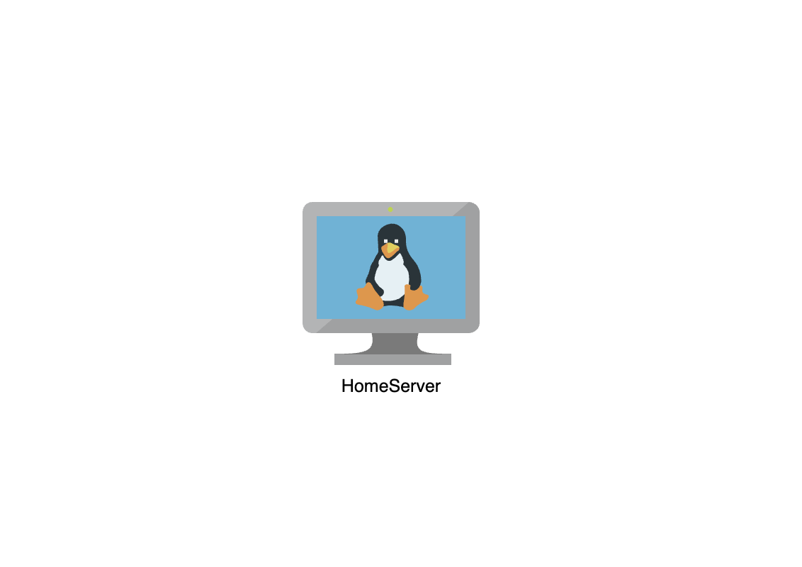

# Section Recap
In this section, we:
- Chose a self-hosting setup
- Picked an operating system (hopefully Linux)
- Performed basic server housekeeping
- Secured our server
- Enabled SSH access
- Installed Docker and Docker Swarm

Here’s a simple diagram of our VM to give a visual sense of what we’ve set up so far. From now on, I’ll expand this diagram at the end of each section to help you see how all the pieces fit together as we progress.

