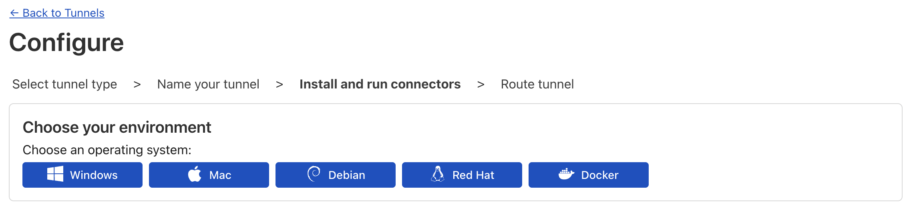
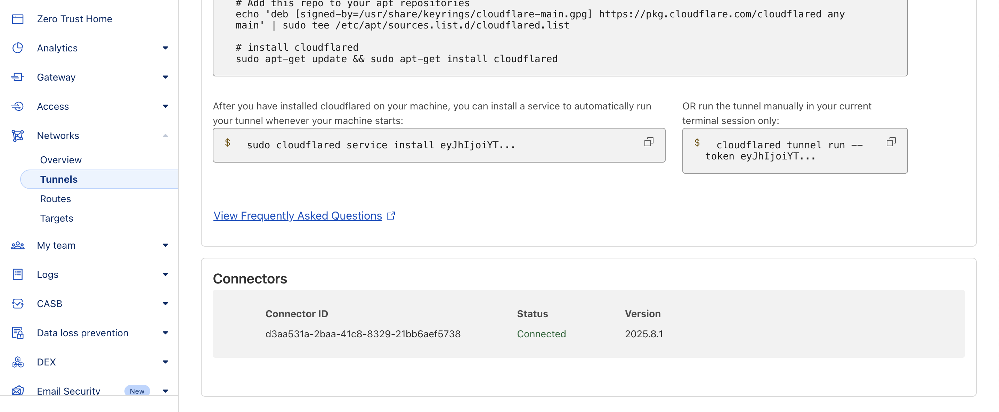
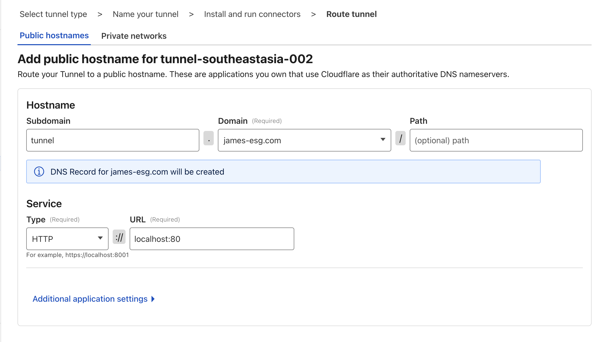

# Creating a Cloudflare Tunnel

Now that you have a Cloudflare account and your own domain, you can create your first **Cloudflare Tunnel**. The official docs[^1] are great, so you can just follow along. But if you’d like to stay on this page, just follow these steps:

1. In the Cloudflare Dashboard, open the side panel and click **Zero Trust** to go to the Zero Trust Dashboard.

2. In the Zero Trust Dashboard, expand the **Networks** section in the side panel and click Tunnels.

3. Click **Create a tunnel**.

4. Select **Cloudflared** as the tunnel type.

5. Give your tunnel a clear, descriptive name, something memorable, since you can create multiple tunnels later.

6. After naming and creating the tunnel, you’ll see these buttons for displaying the setup instructions for different operating systems. If you’re on Ubuntu, you can safely follow the Debian steps (Ubuntu is based on Debian). Similarly, if you’re on Fedora or another RHEL-based distro, use the Red Hat instructions.

7. Copy the provided configuration commands and paste them into your terminal. This will set up `cloudflared`.

8. Once the `cloudflared` service is running, you should see your tunnel marked as Connected in the Cloudflare Dashboard.

9. The next step is to add hostnames that route through your tunnel. For now, let’s add a simple public hostname that we will use in the next chapter:
    - **Subdomain**: tunnel
    - **Domain**: select the domain you registered with Cloudflare
    - **Path**: leave blank
    - **Service**: choose HTTP, and set the URL to `localhost:80`, or even just `localhost`

10. Click **Complete Setup**, and you’re done!

[^1]: [Create a tunnel (dashboard) - Cloudflare Docs](https://developers.cloudflare.com/cloudflare-one/connections/connect-networks/get-started/create-remote-tunnel/)