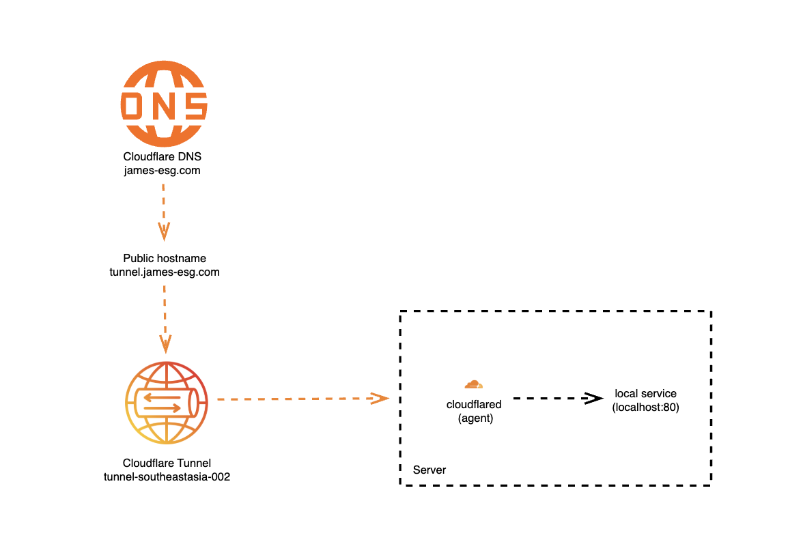

# Section Recap
In this section, we:
- Registered a domain with Cloudflare
- Created our first Cloudflare Tunnel
- Installed and configured the cloudflared agent on our host machine
- Added a public hostname that maps to a local service on the host

It begins with the domain name we registered. When we type that domain into a browser (or use it in any HTTP client), the request is first resolved by Cloudflare’s DNS servers, placing the traffic inside Cloudflare’s global network.

Next, Cloudflare checks the subdomain, in our case, `tunnel.<domain>`. When we created the public hostname earlier, Cloudflare automatically set up a CNAME DNS record for us. This record points `tunnel.<domain>` to the unique hostname of our Cloudflare Tunnel, ensuring the request is routed through the correct tunnel.

Finally, the traffic reaches our host machine. For this chapter, I’ve zoomed in on the server diagram from the previous section to show the components inside. The cloudflared agent, running on the host, maintains a secure outbound connection to Cloudflare’s tunnel service. When a request comes through, cloudflared receives it and forwards it to the local destination we specified during setup, in this case, a service running at `http://localhost:80`.

