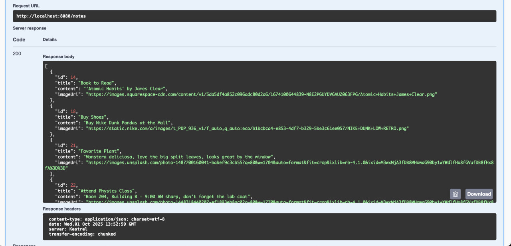
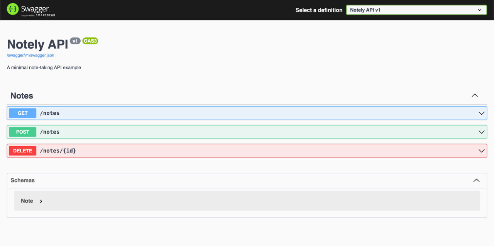

# APIs

Now that we have our database, it’s time to host the REST API that our UI can communicate with.

The API has just three endpoints:
- `GET /notes` – retrieves all notes
- `POST /notes` – adds a new note
- `DELETE /note/{id}` – deletes the note with the specified ID

I've added some test data to the database to test the endpoints properly. Calling the `GET /notes` endpoint returns:



## Database Connection
To connect to the database initially while developing the API on my local, I hardcoded a Postgres connection string in my **appsettings** and used it at runtime. This approach is not secure since it exposes sensitive data in source control. We’ll address how to secure this in a later section.

```json
"ConnectionStrings": {
    "DefaultConnection": "Host=localhost;Port=5432;Database=postgres;Username=postgres;Password=postgres"
}
```
Also notice how I'm using `localhost` as my host for now. This works during development since I'm able to proxy requests to my Postgres service. But once we run this as a container it won't work anymore because there would be no database service running in the API's container. We'll see how to address this in the next section.

## Containerization with Docker
For now, with the API ready, the next step is to serve it through Docker. Since no container image exists on Docker Hub for our app yet, we’ll need to build one ourselves.

The goal is to build a Docker image that contains everything the app needs to run: any binaries, dependencies, source code, and the runtime (if it’s not natively compiled).

I’ve included the Dockerfile I created for the `notely-api` project below. It uses a few optimizations and might look a bit more advanced than a beginner Dockerfile example, but don’t worry too much about that. The important part is simply that it produces a working container image for your API. So you do you.

```dockerfile
FROM mcr.microsoft.com/dotnet/aspnet:8.0 AS base
WORKDIR /app
EXPOSE 8080

FROM mcr.microsoft.com/dotnet/sdk:8.0 AS build
ARG BUILD_CONFIGURATION=Release
WORKDIR /src
COPY ["notely-api.csproj", "."]
RUN dotnet restore "notely-api.csproj"
COPY . .
RUN dotnet build "notely-api.csproj" -c $BUILD_CONFIGURATION -o /app/build

FROM build AS publish
ARG BUILD_CONFIGURATION=Release
RUN dotnet publish "notely-api.csproj" -c $BUILD_CONFIGURATION -o /app/publish /p:UseAppHost=false

FROM base AS final
WORKDIR /app
COPY --from=publish /app/publish .
ENTRYPOINT ["dotnet", "notely-api.dll"]
```

Let's break down what this does into steps:

1. **Base Image**
```dockerfile
FROM mcr.microsoft.com/dotnet/aspnet:8.0 AS base
WORKDIR /app
EXPOSE 8080
```
This stage defines the runtime environment for our API. We start with Microsoft’s official ASP.NET 8.0 runtime image, set /app as the working directory, and expose port `8080`, which is the port our API will run on inside the container.

2. **Build Stage**
```dockerfile
FROM mcr.microsoft.com/dotnet/sdk:8.0 AS build
ARG BUILD_CONFIGURATION=Release
WORKDIR /src
COPY ["notely-api.csproj", "."]
RUN dotnet restore "notely-api.csproj"
COPY . .
RUN dotnet build "notely-api.csproj" -c $BUILD_CONFIGURATION -o /app/build
```
Here, we use Microsoft’s .NET 8.0 SDK image, which includes everything needed to compile the source code. We copy in the project file, restore dependencies, then copy in the rest of the code and build it. The result is a set of compiled binaries in `/app/build`

3. **Publish Stage**
```dockerfile
FROM build AS publish
ARG BUILD_CONFIGURATION=Release
RUN dotnet publish "notely-api.csproj" -c $BUILD_CONFIGURATION -o /app/publish /p:UseAppHost=false
```
This stage takes the compiled code and performs a `dotnet publish`, which trims out unnecessary build files and produces the minimal set of files required to actually run the API. We then drop those into `/app/publish`.

4. **Final Stage**
```dockerfile
FROM base AS final
WORKDIR /app
COPY --from=publish /app/publish .
ENTRYPOINT ["dotnet", "notely-api.dll"]
```
Finally, we start from the smaller ASP.NET runtime image (the `base` stage), copy in only the published output, and set the container to run the app by default with `dotnet notely-api.dll`. This keeps the final image small and focused just on running the API.

## Building the Image

Now that we have a Dockerfile, we can turn it into an image that can be run as a container. Run the following command from the root of the project (where the Dockerfile is located):

```sh
docker build -t jamesesguerra025/notely-api .
```

You can replace the repository and image name with whatever naming convention you prefer.

## Running the Container

Once the image is built, you can start a container from it. The command below runs the container, maps port `8080` inside the container to port `8080` on my host, and gives it a friendly name:

```sh
docker run -d -p 8080:8080 --name notely-api jamesesguerra025/notely-api
```

For this demo, I’ve exposed the Swagger UI in the production build to make it easy to confirm that the API is working. By opening `http://localhost:8080` in a browser, I'm able to see the Swagger UI page and verify that port-forwarding is set up correctly and the API is running.


