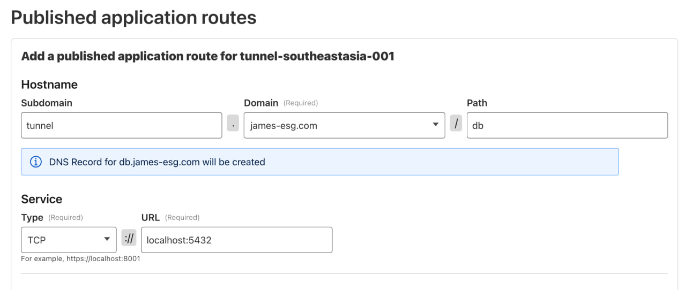
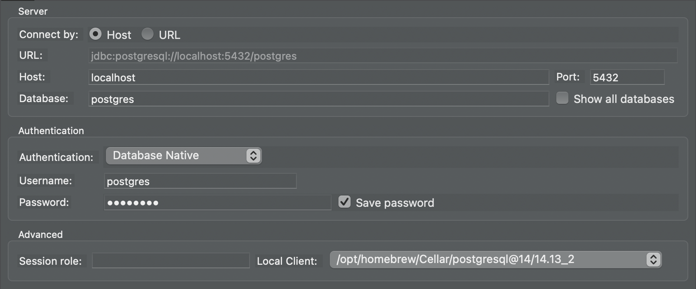
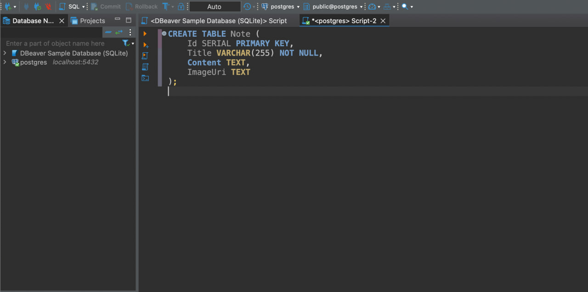

# Exposing for Local Access
If Adminer isn’t your thing (I wouldn’t blame you, it can feel pretty clunky at first), you can connect to the self-hosted database using a tool like DBeaver, TablePlus, or any other SQL client. This assumes that you're hosting on a mini PC though, or that you can connect with another device.

To make this possible, we need to expose the Postgres container’s port so it’s reachable outside of Docker. This is done by adding a `ports` section to your Compose file. Forward host port `5432` to the container’s `5432` (Postgres’s default port). You can also remove the `adminer` service since we won’t need it anymore.

```yml
services:
  db:
    image: postgres
    restart: always
    shm_size: 128mb
    environment:
      POSTGRES_DB: postgres
      POSTGRES_USER: postgres
      POSTGRES_PASSWORD: postgres
    ports:
      - "5432:5432"
    volumes:
      - postgres_data:/var/lib/postgresql/data
```

After saving, restart your services:
```sh
docker compose down && docker compose up -d --remove-orphans
```
You should now only see the db service running.

## Testing Connectivity
You can quickly verify that the container is reachable with:
```sh
curl localhost:1433
```

If you see  `curl: Empty reply from server`, this is actually a good thing. It means the connection works; Postgres just doesn’t speak HTTP. However, if you see `curl: Failed to connect to localhost port 5432`, then something's wrong. Double-check your compose file and restart.

## Exposing through Cloudflare
Now that your DB port is exposed locally, we can make it accessible remotely. Head back to the **Zero Trust Dashboard** and publish a new application route. This time, instead of setting the **Service Type** to `HTTP`, choose `TCP`, since databases don’t respond to HTTP traffic.



## Using `cloudflared` for SQL Access
We already set up cloudflared when connecting our host to the tunnel. But if you’re connecting from another device, you’ll need to install it there as well, since we’ll use it to authenticate to the tunnel. Just follow the official documentation[^1] for your OS.

Once installed, authenticate by running:
```sh
 cloudflared login
```

Then run the following command (replacing the hostname with yours). This opens a local port on your machine that securely forwards traffic through Cloudflare to your Postgres service, allowing tools like DBeaver to connect without needing to know about Cloudflare. Think of it like a proxy: any traffic sent to localhost:5432 will be routed through Cloudflare to your application route.

```sh
cloudflared access tcp --hostname tunnel.james-esg.com/db --url localhost:5432
```

Keep this command running as you move to the next step. It'll occupy the terminal, so be sure to leave it open.

## Connecting with DBeaver
After saving the application route, let’s connect to the database using a SQL client. For this example, I'll be using [DBeaver](https://dbeaver.io/).

From the landing window, create a new connection and select PostgreSQL as the database type. Most SQL clients follow a similar flow: create a new connection, choose the database type, then provide the server details and credentials.

For my Host, enter `localhost`, then fill in the same credentials as before. 



Click **Test Connection** to make sure everything is working. If the test succeeds, click **Finish**. You should now be able to run queries against your server in a friendlier, more familiar interface. And because I’m used to just typing queries in an editor, I’ll take the time to enter my `CREATE TABLE` statement for our `Note` table.



[^1]: [cloudflared Downloads - Cloudflare](https://developers.cloudflare.com/cloudflare-one/connections/connect-networks/downloads/)