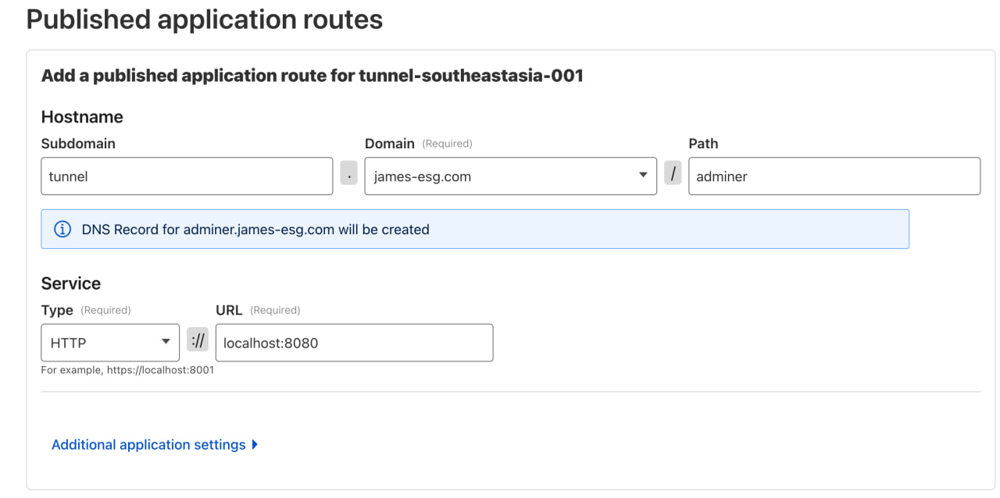
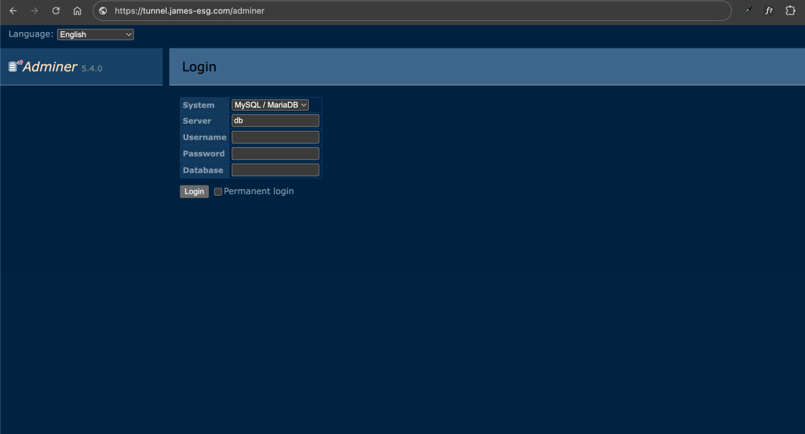
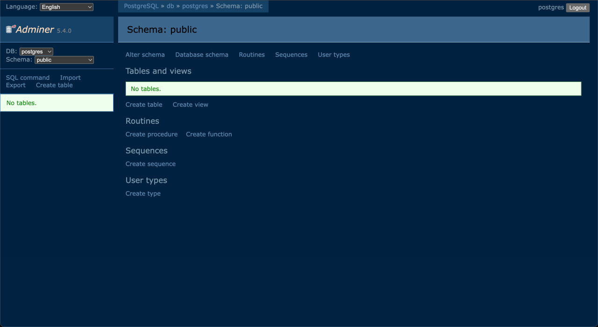

# Databases
Now that we’ve shown we can route traffic properly, it’s time to set up and connect to a database, the core of any full-stack app.

## Docker Compose Setup
For this example, we’ll use Postgres, since it’s open source, widely supported, popular, and relatively lightweight compared to other options.

To get started, let’s grab part of the `docker-compose.yml` file from Postgres’ official Docker Hub documentation[^1], then run `docker compose up -d` in the same directory to spin up the services:

```yml
services:
  db:
    image: postgres
    restart: always
    shm_size: 128mb
    environment:
      POSTGRES_DB: postgres
      POSTGRES_USER: postgres
      POSTGRES_PASSWORD: postgres

  adminer:
    image: adminer
    restart: always
    ports:
      - 8080:8080
```

Here’s what this does:
- It starts a `db` service running the latest `postgres` image, with default values for the database name, user, and password
- It also starts an `adminer` service on port 8080, giving us a handy web-based GUI to manage the database

Notice that we aren’t exposing the `db` service directly to the host. For now, the only way to connect to and interact with it is through Adminer.

## Exposing Adminer Through Cloudflare Tunnel
Now, we still can’t access the Adminer web UI from our domain. To fix this, we need to publish another application route that forwards traffic from a URL on our domain to the local Adminer service.

Head back to the **Zero Trust Dashboard** on Cloudflare, open the **Tunnels** section, and look for the tunnel running on our host. Click **Edit**, then go to the **Published application routes** tab to add a new route.



For this example, I’ll use `tunnel` as the subdomain again, select my domain, and set `adminer` as the path. (You can adjust this however you like for your setup.) Next, choose **HTTP** as the service type and set the port to `8080`, since that’s where we exposed Adminer in the previous step. Once you’re done, click Save and wait a moment for the changes to apply.

After saving, open the new URL in your browser, and you should see the Adminer login screen. To log in successfully, select `PostgreSQL` in the **System** dropdown, use `db` as the Server, and enter `postgres` as the **Username**, **Password**, and **Database**.



And that’s it, we’re in. Now we can create tables, run queries, and manage our database from the browser.



If you’re not a fan of Adminer and its quirks, don't worry just yet. In the next section we’ll explore another option for managing your database.

[^1]: [postgres - Docker Hub](https://hub.docker.com/_/postgres)