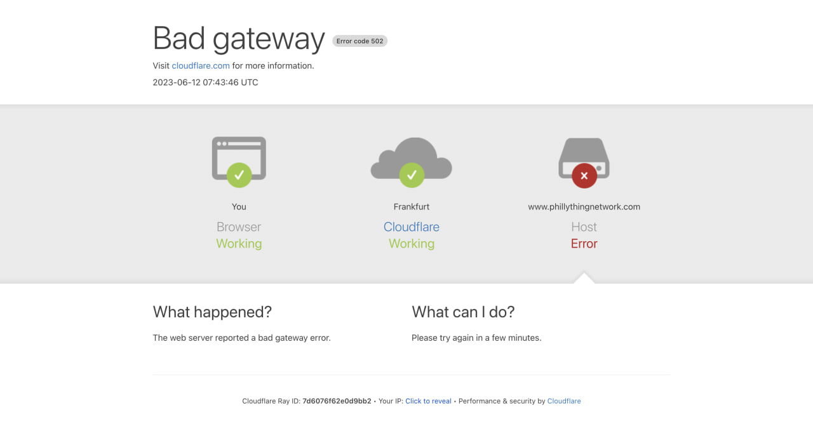
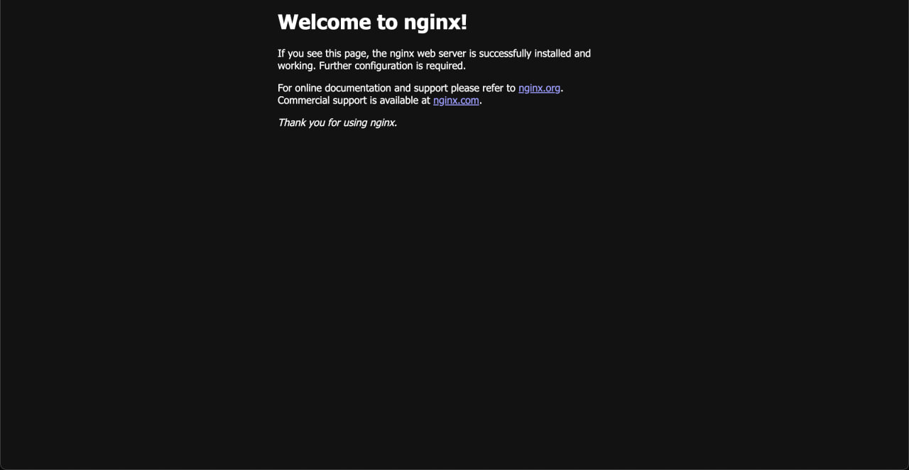

# Hello, Tunnel!
Now that we've set up a tunnel and a public hostname, let’s see what we can do with it. In typical programming fashion, let’s start with a simple “Hello, world” example by running a service on localhost:80 (or just localhost) to check if it can be exposed properly through our tunnel.

At the moment, if you visit `tunnel.<domain>`, you’ll see this error page. This means Cloudflare was able to route the traffic correctly but received an invalid response from our upstream service. That’s expected, we haven’t started anything on `localhost` yet, so there’s nothing to respond.



To test, we’ll expose a basic Nginx web server, which typically runs on port 80. Run the following command to start the latest Nginx image from Docker Hub and forward traffic from port 80 on your host to port 80 in the container:

```sh
docker run -dp 80:80 --name nginx nginx
```

To confirm it's working locally, run:

```sh
curl localhost
```

You should see some HTML output, which is the default Nginx welcome page. If you don’t, check whether the container started properly using `docker ps` and `docker logs`.

Once that works, open `tunnel.<domain>` in your browser, and you should see the same welcome page!




Great, we’ve successfully exposed a web server and routed traffic to it, all without poking a hole through our home network. From here, the possibilities really open up.
