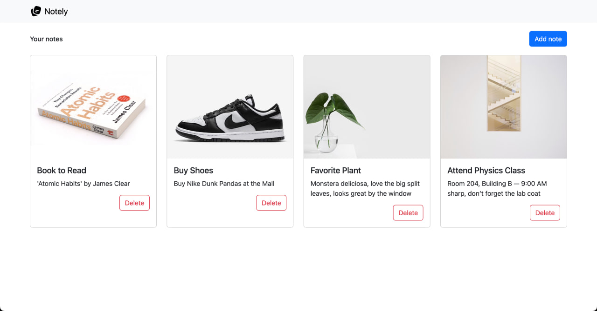

# Introducing Our Sample App

## Notely

Before we dive into hosting more services, i'll try to ground ourselves with a concrete example. Throughout this chapter, I’ll be using a simple full-stack app called **Notely**.

Notely is a super minimal note-taking app that supports the basic CRUD (Create, Read, Update, Delete) operations. It simply allows you to view notes, add notes, and delete notes. In reality, what the app does doesn’t really matter. The focus here is on learning how to host and connect the different parts of a full-stack app. I chose something this simple so we can keep our attention on the hosting concepts rather than the app’s complexity.

Each note has just a few fields:
- `id` – a unique identifier
- `title` – a short text label
- `content` – the main body of the note
- `imageUri` – a string that points to an uploaded image

The app is built with React on the frontend and .NET Core on the backend. React gives us a clean, interactive UI for managing notes, while .NET Core provides the API that connects to our database and exposes the necessary endpoints.

It’s deliberately simple, but this simplicity is what makes it a perfect learning companion. With Notely, we’ll touch on the main building blocks of almost any full-stack app:
- a **database** for storing notes
- an **API** that acts as a structured connector to our database
- a **UI** so users can actually interact with them
- **object storage** for image uploads

Even though I’ll be walking through everything in the context of Notely, the concepts apply to just about any app you might want to host. So whether you’re building a recipe manager, a small blog, or your next big idea, you should be able to follow along and apply the same principles.

## Using Different Services

Notely is just an example, you don’t have to use the exact services I’m showing. For any part of your stack, you can find a container that works for your preferred tool and follow its instructions to set it up. It's really just as simple as going to [Docker Hub](https://hub.docker.com/), searching for what you want, and following their setup instructions. 

That said, you’ll have to do a bit more grunt work from your end: reading the documentation, configuring the container to fit your setup, and making sure it can communicate with the other services in your environment. Some tweaks to networking, environment variables, or storage paths might be necessary, but the hosting concepts in this book: connecting services, networking containers, and exposing endpoints, all apply the same way. This gives you the flexibility to experiment with whatever stack you like while following along.