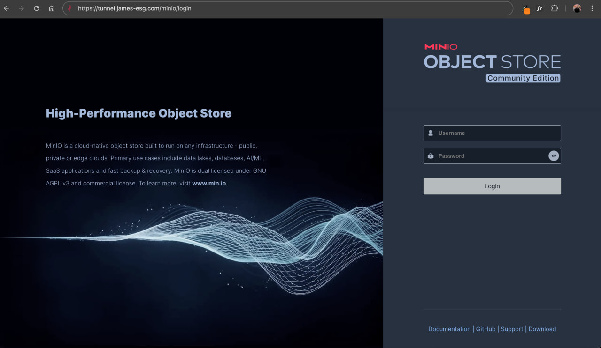
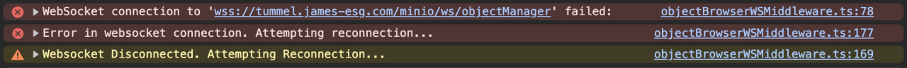
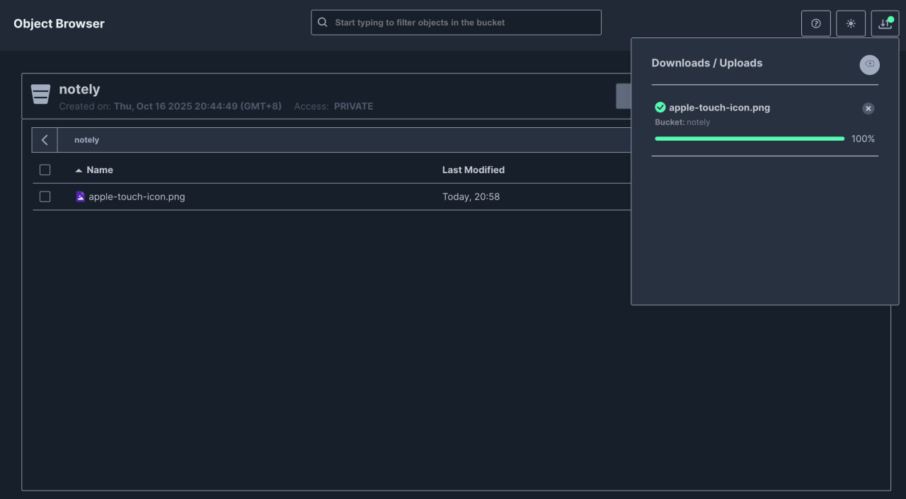
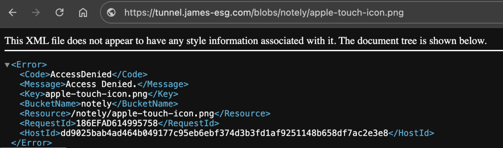
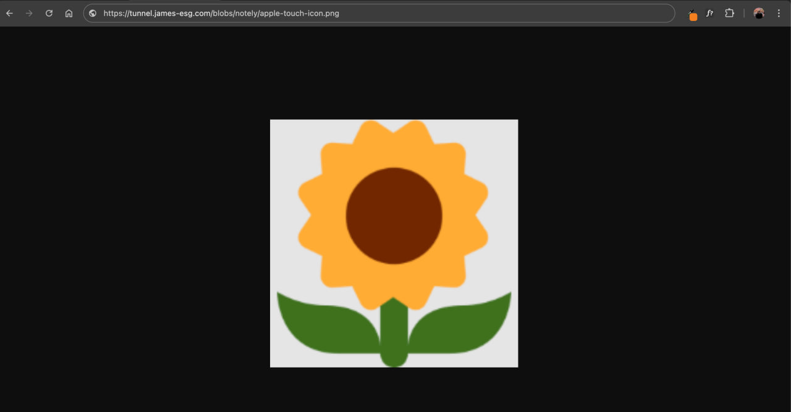

# Object Storage
The next thing our app needs is a way to store blobs, objects, and essentially, images. This will serve as our equivalent of Amazon S3 or Azure Blob Storage. There are several open-source and self-hostable options available, such as [Ceph](https://ceph.io/en/), [SeaweedFS](https://github.com/seaweedfs/seaweedfs), and [Garage](https://garagehq.deuxfleurs.fr/). I personally haven't tried them but have heard good things. The one that consistently comes up the most, and the one we’ll be using, is [MinIO](https://www.min.io/).

## Why MinIO?
I'm choosing MinIO because it's a lightweight yet high performance object storage solution that’s designed to be simple to deploy and easy to scale. It’s one of the most popular self-hosted alternatives to commercial cloud storage services like Amazon S3 or Azure Blob Storage.

One of its biggest strengths is that it’s fully S3 API compatible, meaning any application or SDK that works with Amazon S3 will also work seamlessly with it. This makes it incredibly easy to integrate into existing apps or migrate workloads without changing your code.

## Setting up MinIO
To set it up, let's first add a new MinIO service to our stack. Add the following `minio` service to the `docker-stack.yml` file.

```yml
minio:
    image: minio/minio
    container_name: minio
    volumes:
        - ./minio-data:/data
    environment:
        - MINIO_ROOT_USER=admin
        - MINIO_ROOT_PASSWORD=password
        - MINIO_LICENSE=accept
        - MINIO_BROWSER_REDIRECT_URL=http://localhost/minio
    command: server /data --console-address ":9001"
    restart: unless-stopped
    networks:
        - home
```

Notice that we’re using a bind mount instead of a named volume. This makes it much easier to access the MinIO objects directly on the host, so you can manipulate them as regular files, You can copy, compress, or back them up if needed. It needs that folder to start up correctly, so let's create it.

```sh
mkdir minio-data
```

Also, there’s no `ports` configuration anymore. With our proxy in place, we don’t need to expose services directly; all traffic will be routed through the `proxy` service from here on.

Lastly, take note of the credentials we’ve set as environment variables; we’ll use these to log in later. You can also update them if you need to. After making any changes, don’t forget to update the stack.

## Routing Traffic to MinIO
We can route traffic to our new `minio` service simply by creating a new `location` directive in our custom `default.conf` Nginx configuration file.

First, let’s note the ports that MinIO exposes:
1. `9000` - used to interact with its data API and to store/retrieve objects
2. `9001` - exposes the web UI (admin dashboard)

Since MinIO exposes two ports, we need to create two corresponding locations in Nginx so it can proxy requests appropriately.

With that in mind, we can follow the same approach we used for the Notely API. Add the following `location` directives under the Notely API block. Here, we're saying we want requests to `/minio` to be routed to the admin dashboard of the `minio` service, and requests to `/blobs` to be routed to its data API.

```nginx
location /minio/ {
    proxy_pass http://minio:9001/;
    proxy_set_header Host $host;
    proxy_set_header X-Real-IP $remote_addr;
    proxy_set_header X-Forwarded-For $proxy_add_x_forwarded_for;
    proxy_set_header X-Forwarded-Proto $scheme;
}

location /blobs/ {
    proxy_pass http://minio:9000/;
    proxy_set_header Host $host;
    proxy_set_header X-Real-IP $remote_addr;
    proxy_set_header X-Forwarded-For $proxy_add_x_forwarded_for;
    proxy_set_header X-Forwarded-Proto $scheme;
}
```

Rebuild the image and push the updated version to Docker Hub. Once that’s done, redeploy the stack. Afterward, navigate to `https://tunnel.james-esg.com/minio`; you should get redirected to `/minio/login` and see the MinIO login page.



Cool, we were able to expose this cool-looking dashboard. Enter the credentials you set earlier in the Stack configuration. Once logged in, you should see the Object Browser, where you can create a bucket to get started. Click the **Create a Bucket** button and give it a name. I'll call mine `notely`. 

After creating the bucket, you’ll be directed to it. The bucket loads its contents (which should be empty), but you might notice that it keeps loading indefinitely. Checking the browser console reveals that a WebSocket connection is failing. This is common, as many dashboards implement real-time features that rely on WebSockets, which are currently unable to connect.



The issue is that Nginx needs extra headers to handle WebSocket connections. Add the following headers in the `location` block for the `/minio` path:

```nginx
location /minio/ {
    # ...other proxy headers
    proxy_set_header Upgrade $http_upgrade;
    proxy_set_header Connection "Upgrade";
}
```

Afterward, reload the page, and the loading should complete. Click the **Upload** button and try uploading an image. You should see a popup displaying the upload progress, which is especially useful when bulk-uploading files.



## Exposing MinIO Objects
### Accessing Uploaded Objects
Now it’s time to expose the image we just uploaded and test if we can access it from our browser. Recall that we created a separate path configuration, `/blobs`, to access MinIO’s data API. Or in other words, to serve objects.

We should be able to access the image by navigating to `https://tunnel.james-esg.com/blobs` and appending `/<bucket-name>/<object-name>`. For example, our bucket is named `notely` and the file we uploaded is `apple-touch-icon.png`.

However when we enter that URL in the browser, we’re shown what appears to be an XML document with an error. A closer look reveals that we don’t have access to the object.



Returning to the dashboard, it becomes clear what’s causing the error: new buckets are private by default. That’s why we can’t access their objects yet.

### Using the MinIO Client (mc) for Access Control
If you try searching the dashboard for a setting to make a bucket public, you won’t find one. MinIO doesn’t allow access control changes directly from the dashboard. This is because MinIO’s design enforces access control at the API level to help maintain security and consistency across services.

A quick way to configure access control via the API is by using the [MinIO Client](https://github.com/minio/mc). The `minio/minio` container actually already has this installed, so we can just use it through there.

To test it, we can execute the `mc ls` against the MinIO container. This lists down the buckets and objects.
```sh
docker exec -it <container-id> mc ls
```

If that runs successfully, we can add an alias to store our server credentials:
```sh
docker exec -it <container-id> mc alias set local http://minio:9000 admin password
```

Now, let's make our `notely` bucket public by using the `anonymous` command to manage anonymous access to buckets.
```sh
docker exec -it <container-id> mc  anonymous set public local/notely
```

After running these commands, the bucket should now be publicly accessible. Visiting the image URL again should now successfully serve the uploaded file.




