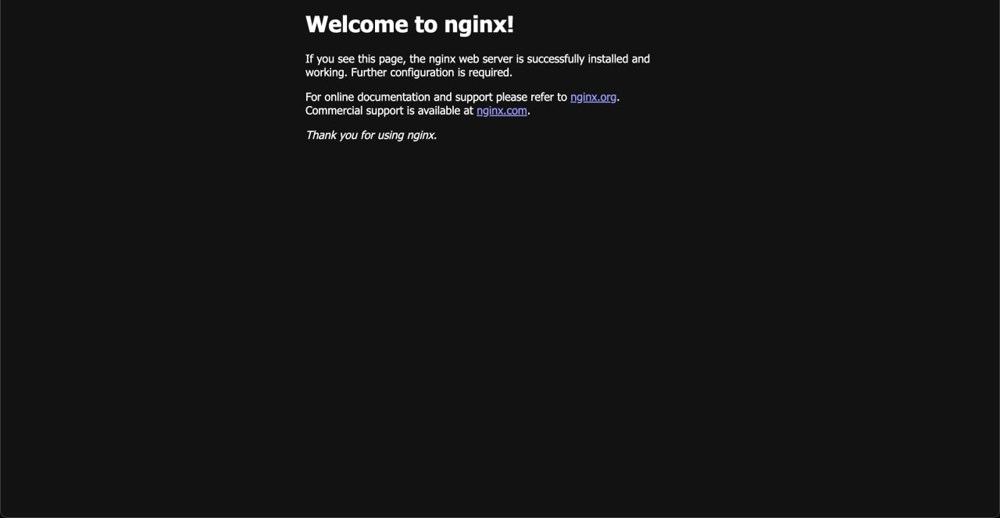

# Using the Proxy
Now that we have our custom Nginx image, it’s time to integrate it into our stack and start using it.

## Updating the stack
Add the following to the `docker-stack.yml` file to include the new `nginx` service using the custom image.

```yml
nginx:
    image: jamesesguerra025/nginx
    ports:
      - target: 80
        published: 80
        protocol: tcp
        mode: host
    networks:
      - home
```

While we’re at it, let’s do a bit of housekeeping. We can now remove the ports configuration from our `notely-api` service. Since requests to this service will now go through our `nginx` service, there’s no need to expose it directly. After cleaning it up, your service definition should look like this:

```yml
notely-api:
    image: jamesesguerra025/notely-api
    networks:
      - home
```

Finally, run the following command to update the running stack:
```sh
docker stack deploy -c docker-stack.yml home
```

You can quickly verify that it’s running by executing `curl localhost`. It should return the same HTML content from the Nginx welcome page we saw several pages ago.

## Updating Cloudflare Application Routes
Okay, I promise this is the last time we’ll need to publish an application route on Cloudflare. We just need to add one final route for the Nginx service. After this, exposing new services will simply involve adding a new `location` directive to our custom Nginx configuration and updating the stack.

Head back to the **Zero Trust Dashboard** and publish a new application route for the Nginx service. It's better to leave the `Path` as blank because we'll be routing everything through this service anyway, and we'll definitely run into weird issues with paths later on and having a non-blank path would make things a lot more confusing.


While we're here, we can also delete the application route we made for our Notely API service as well.

## Testing the Proxy
Now it’s time to test routing traffic through our proxy. First, navigate to `https://tunnel.james-esg.com/`, the root location we defined in our config, and we should see the Nginx Welcome Page yet again.



Next, let’s test the `location` directive we added for the Notely API. To forward requests, we need to prefix the URL with `notely-api` as defined in our config. For example, to access the `GET /notes` endpoint, enter `https://tunnel.james-esg.com/notely-api/notes` into the browser. If everything's okay, it should return the note records we added.


